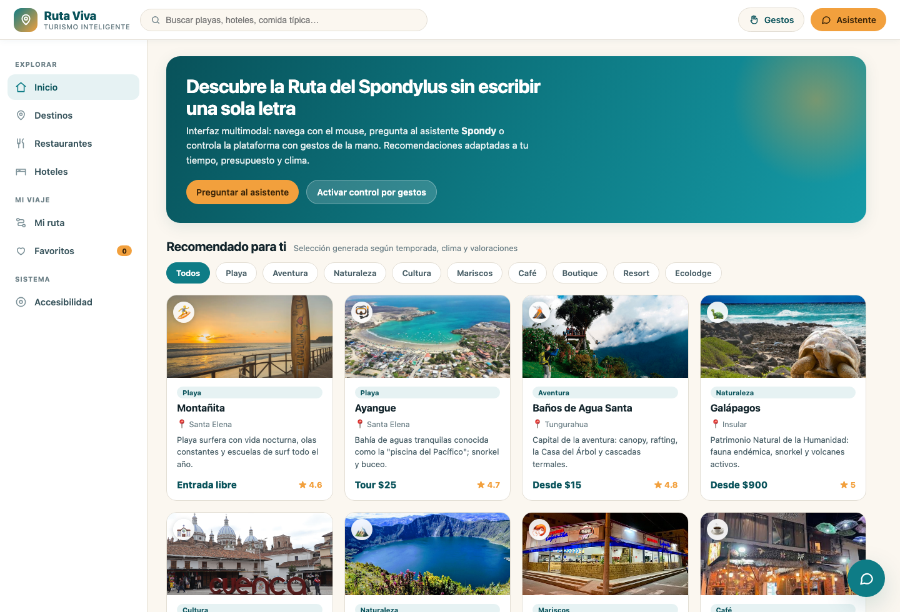
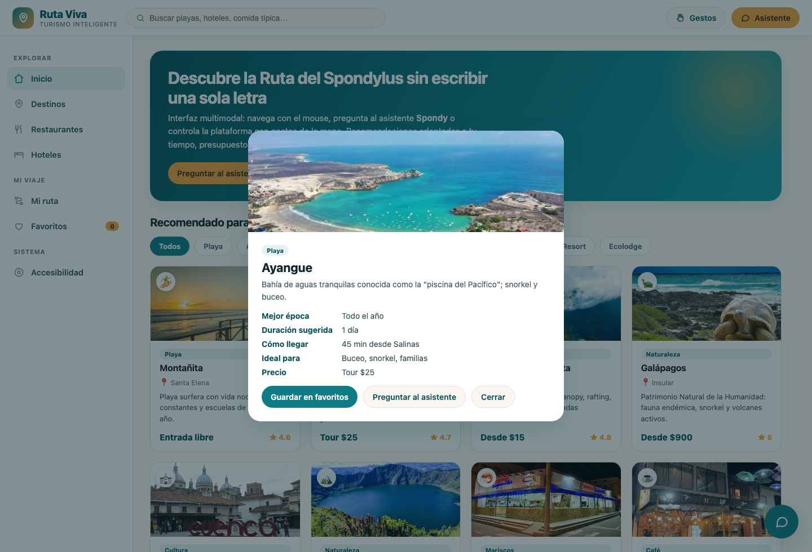
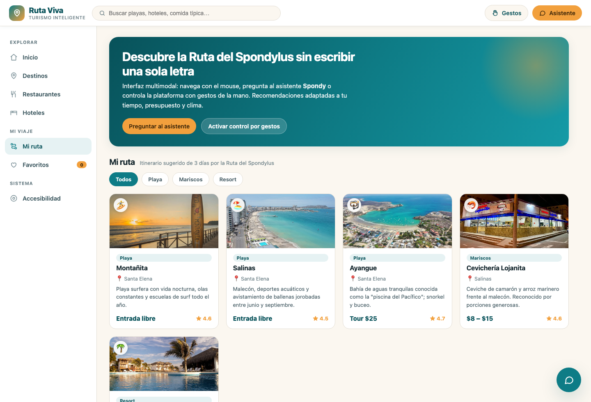
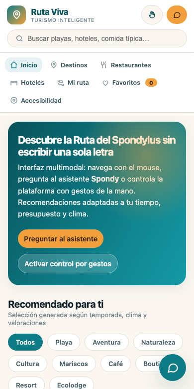
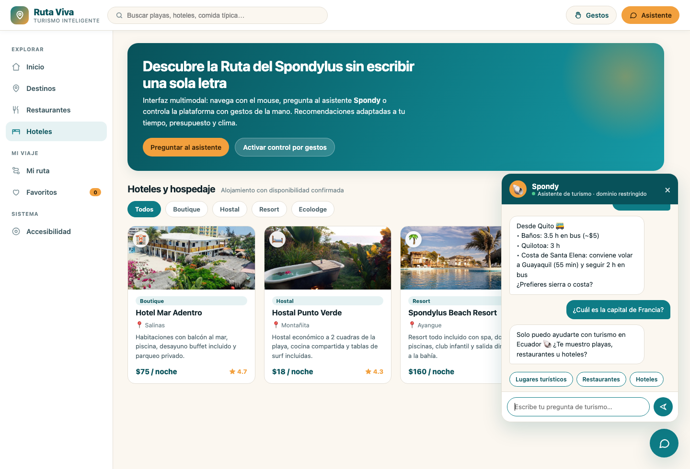
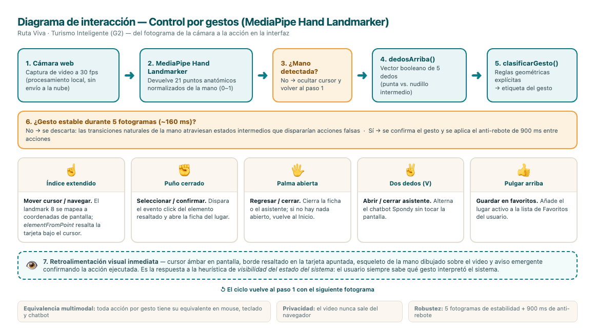
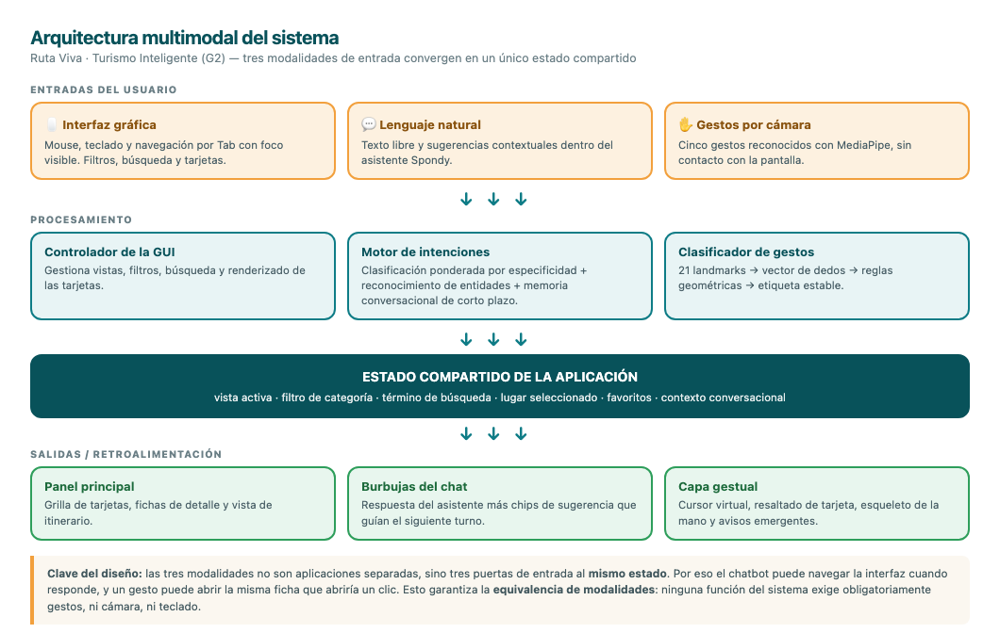
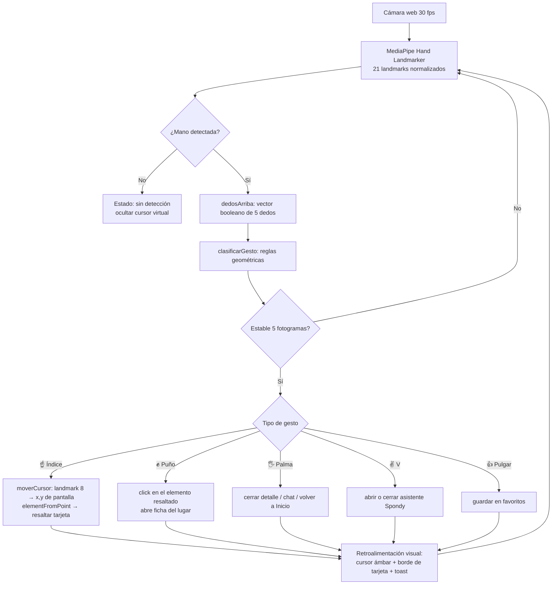
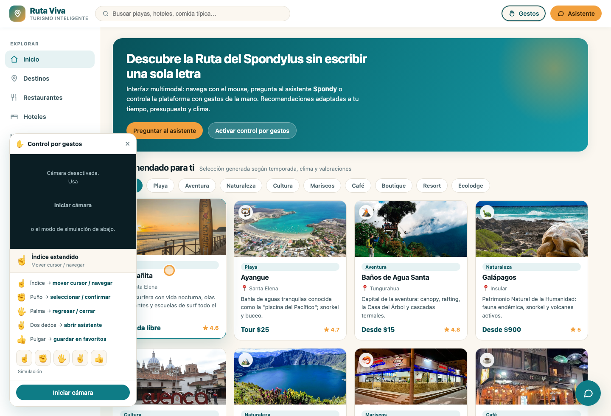

# Examen Práctico — Diseño de Interacción Hombre–Máquina e Inteligencia Artificial

**Estudiante:** Diana Melena Santander
**Actividad:** Desarrollo de una Interfaz Inteligente Multimodal Asistida por IA
**Escenario asignado:** **G2 — Turismo Inteligente**
**Proyecto:** *Ruta Viva · Turismo Inteligente* (Ruta del Spondylus, Ecuador)
**Docente:** Msia. Daniel Quirumbay Y.
**Ponderación:** 20 puntos

---

## Resumen del proyecto

*Ruta Viva* es una plataforma web de turismo inteligente para la costa ecuatoriana que integra **tres modalidades de interacción sobre una misma interfaz**:

| Modalidad | Tecnología | Rol en el sistema |
|---|---|---|
| Interfaz gráfica (GUI) | HTML/CSS/JS, diseño asistido por IA | Exploración visual, filtros, comparación |
| Asistente conversacional | Chatbot parametrizado "Spondy" (NLU por intenciones) | Consultas en lenguaje natural, desambiguación |
| Reconocimiento de gestos | MediaPipe Hand Landmarker (21 puntos) | Control sin contacto para tótems y uso en playa |

Toda acción del sistema puede completarse por **al menos dos vías distintas**, cumpliendo el principio de *equivalencia de modalidades*.

**Archivo ejecutable:** `index.html` (se abre directamente en el navegador, sin instalación).

---

# 1. Diseño inteligente de la interfaz (5 puntos)

## 1.1 Prompt utilizado

> Herramienta: **Claude / Figma AI (Uizard alternativo)** — prompt de diseño generativo.

```text
Actúa como diseñador UX/UI senior especializado en interfaces multimodales.

Diseña la interfaz de una plataforma web de TURISMO INTELIGENTE llamada "Ruta Viva",
enfocada en la Ruta del Spondylus (costa de Santa Elena, Ecuador).

USUARIO OBJETIVO:
Turista nacional de 22 a 45 años, viaja en pareja o grupo pequeño, presupuesto medio-bajo,
planifica desde el celular con conexión intermitente y poco tiempo de decisión.

NECESIDAD QUE RESUELVE:
La información turística está dispersa entre redes sociales, blogs y grupos de WhatsApp.
El usuario necesita decidir en menos de 3 minutos: dónde ir, dónde comer y dónde dormir,
con precios reales y sin registrarse.

REQUISITOS OBLIGATORIOS DE LA INTERFAZ:
1. Pantalla principal con hero de bienvenida y llamados a la acción.
2. Menú de navegación lateral persistente agrupado en secciones.
3. Panel principal con tarjetas de destinos, restaurantes y hoteles.
4. Botones primarios, secundarios y de filtro claramente jerarquizados.
5. Iconografía coherente (línea, 2px, esquinas redondeadas) para cada sección.
6. Identidad visual consistente: paleta, tipografía, radios y sombras unificados.

CRITERIOS DE DISEÑO:
- Paleta inspirada en el Pacífico ecuatoriano: turquesa marino como primario,
  ámbar de atardecer como acento, arena como fondo.
- Contraste mínimo AA (4.5:1) en todo el texto de contenido.
- Área táctil mínima de 44x44 px (uso en tótem y en playa con manos mojadas).
- Jerarquía visual en 3 niveles: hero > secciones > tarjetas.
- Debe convivir con un chatbot flotante y un panel de control por gestos
  sin que ninguno tape el contenido principal.

ENTREGA:
Sistema de diseño (tokens de color, tipografía, espaciado) + layout de la pantalla
principal + estados hover/foco/seleccionado de cada componente.
```

## 1.2 Captura del diseño

| Vista | Archivo |
|---|---|
| Pantalla principal (hero + menú + panel + tarjetas) | `assets/captura-01-inicio.png` |
| Vista de detalle de un destino | `assets/captura-detalle.png` |
| Vista "Mi ruta" (itinerario generado) | `assets/captura-ruta.png` |
| Adaptación a tablet (768 px) | `assets/captura-tablet.png` |
| Adaptación a móvil (390 px) | `assets/captura-movil.png` |









**Diseño responsive.** Como el usuario objetivo planifica desde el celular, la interfaz reorganiza sus componentes en tres puntos de quiebre en lugar de encogerlos: en **escritorio** el menú es una columna lateral persistente; bajo **880 px** el encabezado pasa a dos filas (marca y acciones arriba, buscador ocupando el ancho completo) y el menú se convierte en una barra horizontal deslizable con *scroll-snap*; bajo **560 px** los botones de modalidad conservan solo el icono y la grilla pasa a una sola columna. Para que la barra horizontal no parezca contenido cortado, se añadió un **degradado en el borde hacia el que aún queda menú por recorrer**, que se calcula en tiempo real según la posición de desplazamiento — es la aplicación directa de la heurística de *visibilidad del estado del sistema* a un componente de navegación.

## 1.3 Descripción

**Usuario objetivo.** El usuario primario es el **turista nacional de 22 a 45 años** que viaja por la costa ecuatoriana con presupuesto medio-bajo, decide con poca antelación y consulta desde el celular con conexión intermitente. Un segundo perfil es el **visitante en punto de información turística (tótem)**, que interactúa de pie, sin teclado y frecuentemente con las manos ocupadas o húmedas; este perfil es el que justifica la incorporación del control por gestos. Ambos comparten una característica crítica: **baja tolerancia a la fricción**: si la información no aparece en pocos segundos, abandonan y vuelven a redes sociales.

**Necesidad que resuelve.** Hoy la información turística de la Ruta del Spondylus está fragmentada entre publicaciones de Instagram, blogs desactualizados y grupos de WhatsApp, sin precios confiables ni disponibilidad verificada. *Ruta Viva* concentra destinos, restaurantes y hospedaje en un solo panel con precio, valoración, temporada recomendada y accesibilidad verificada, y permite resolver la decisión completa (**dónde ir, dónde comer, dónde dormir**) sin registro previo. La interfaz añade una capa de inteligencia: el asistente arma itinerarios y el sistema recomienda según temporada, clima y valoración.

**Decisiones tomadas por la IA durante el diseño.** A partir del prompt, la herramienta de IA tomó y justificó las siguientes decisiones: (1) **paleta y tokens** — turquesa marino `#0E7C86` como primario por asociación semántica con el mar y por alcanzar contraste 4.8:1 sobre fondo arena `#FBF7F0`, con ámbar `#F2A03D` reservado exclusivamente para la acción principal, evitando que el usuario compita entre dos llamados; (2) **navegación lateral persistente en lugar de menú hamburguesa**, argumentando que en escritorio y tótem la visibilidad permanente reduce la carga de memoria (heurística de Nielsen: *reconocer antes que recordar*); (3) **agrupación semántica del menú** en "Explorar / Mi viaje / Sistema", que redujo de siete a tres los bloques que el usuario debe escanear; (4) **layout de tarjetas en grilla fluida** (`minmax(258px, 1fr)`) para que el mismo componente sirva a destinos, restaurantes y hoteles, reduciendo el sistema a un único componente reutilizable; (5) **iconografía de línea uniforme** de 2 px de grosor con terminaciones redondeadas para toda la app, generada con criterio de consistencia visual; y (6) **posicionamiento de las capas flotantes**: el chatbot en la esquina inferior derecha y el panel de gestos en la inferior izquierda, para que ninguna de las dos modalidades ocluya el panel principal ni compita entre sí.

Sobre estas propuestas se aplicaron dos **correcciones humanas**: la IA sugería originalmente texto gris `#8A9BA1` sobre fondo arena para las descripciones (contraste 2.9:1, por debajo de AA), que se reemplazó por `#4A6068` (contraste 6.1:1); y proponía tarjetas sin borde apoyadas solo en sombra, lo que hacía invisible el estado de foco por teclado y el resaltado por gestos, por lo que se añadió borde de 1 px con cambio de color en `hover`, `focus-visible` y `gest-hover`.

---

# 2. Implementación de un Chatbot Parametrizado (5 puntos)

## 2.1 Prompt / configuración utilizada

La parametrización completa está implementada en el objeto `CONFIG_BOT` de `index.html` y exportada en `chatbot-config.json` (formato importable a Botpress / Voiceflow / Dialogflow).

```text
ROL / OBJETIVO
Eres "Spondy", asistente virtual embebido en la app de turismo "Ruta Viva".
Tu objetivo es ayudar al turista a planificar su viaje por Ecuador resolviendo
consultas sobre lugares turísticos, restaurantes y hoteles en menos de 3 turnos.

CONTEXTO DEL SISTEMA
Operas dentro de la aplicación Ruta Viva. Tu única fuente de información es la base
de datos de la app (destinos, restaurantes y hoteles de la Ruta del Spondylus y
destinos destacados del Ecuador, con precio, horario, temporada y accesibilidad).
No tienes acceso a pasarelas de pago, datos personales ni reservas reales.

PERSONALIDAD
Cercano, entusiasta y breve. Tratas al usuario de "tú". Máximo 4 líneas por respuesta.
Cierras siempre con una pregunta o una acción sugerida. Máximo un emoji por mensaje.

RESTRICCIONES (obligatorias)
1. Respondes ÚNICAMENTE sobre turismo: destinos, gastronomía, hospedaje, transporte,
   clima, costos e itinerarios.
2. Si la consulta está fuera del dominio, la declinas amablemente y reconduces al turismo.
3. No inventas precios, horarios ni disponibilidad: solo usas datos de la base de la app.
4. No solicitas ni almacenas datos personales, tarjetas ni documentos de identidad.
5. Ante una consulta ambigua, formulas una pregunta de desambiguación antes de responder.
6. No emites recomendaciones médicas, legales ni de seguridad personal.

INTENCIONES PRINCIPALES
1. consultar_lugares_turisticos
2. buscar_restaurantes
3. reservar_hospedaje
(secundarias: consultar_precios, consultar_clima_temporada, consultar_transporte,
 armar_itinerario, accesibilidad_servicios, saludo, despedida)

FALLBACK
"Solo puedo ayudarte con turismo en Ecuador 🐚 ¿Te muestro playas, restaurantes u hoteles?"
```

## 2.2 Parametrización

| Parámetro | Valor configurado |
|---|---|
| **Nombre** | Spondy |
| **Objetivo** | Resolver consultas de destinos, restaurantes y hospedaje en ≤ 3 turnos |
| **Contexto** | Asistente embebido en Ruta Viva; fuente única = base de datos de la app |
| **Personalidad** | Cercano, entusiasta, breve; tuteo; máx. 4 líneas y 1 emoji |
| **Restricciones** | 6 reglas duras (dominio, no inventar datos, no pedir datos personales, desambiguar, no consejo médico/legal) |
| **Intención 1** | `consultar_lugares_turisticos` |
| **Intención 2** | `buscar_restaurantes` |
| **Intención 3** | `reservar_hospedaje` |
| **Fallback** | Reconducción explícita al dominio turístico |

## 2.3 Evidencia de respuestas (flujo conversacional real)

Capturas: `assets/captura-chat.png`



| # | Pregunta del usuario | Intención detectada | Respuesta del asistente |
|---|---|---|---|
| 1 | ¿Qué lugares turísticos puedo visitar? | `consultar_lugares_turisticos` | "Los más valorados ahora mismo son: • Ayangue ★4.7 – snorkel en aguas calmadas • Montañita ★4.6 – surf y vida nocturna • Quilotoa ★4.9 – laguna volcánica. ¿Prefieres playa o montaña?" *(+ navega a Destinos)* |
| 2 | ¿Dónde puedo comer ceviche? | `buscar_restaurantes` | "Para comer rico y barato te recomiendo: • Cevichería Lojanita (Salinas) – $8-15 • Doña Elena (Montañita) – $4-8 • Café Spondylus (Ayangue) – $3-9. ¿Buscas mariscos, comida típica o algo internacional? 🦐" |
| 3 | Hoteles baratos en Montañita | `reservar_hospedaje + lugar` | "Hospedaje en Montañita: 🛏️ Hostal Punto Verde – $18/noche · ★4.3. ¿Quieres ver el detalle de alguno?" *(resolución compuesta intención + entidad)* |
| 4 | ¿Cuánto cuesta viajar por la costa? | `consultar_precios` | "Rangos reales de la app: entradas gratis a $3; comida $4–$20; hospedaje $18–$160. Con $60 al día viajas cómodo. ¿Armo una ruta con ese presupuesto?" |
| 5 | ¿Cuál es la mejor época para ir? | `consultar_clima_temporada` | "En la costa: Dic–Abr cálido y soleado; Jun–Sep fresco pero es temporada de ballenas 🐋. En la sierra lleva chompa: baja a 8 °C. ¿Para qué mes viajas?" |
| 6 | Arma un itinerario de 3 días | `armar_itinerario` | "Día 1 · Salinas… Día 2 · Ayangue… Día 3 · Montañita… La cargué en 'Mi ruta'. ¿La ajusto a 2 días? 🗺️" *(+ navega a Mi ruta)* |
| 7 | ¿Hay lugares accesibles en silla de ruedas? | `accesibilidad_servicios` | "Con accesibilidad verificada: Café Spondylus, Spondylus Beach Resort y Hotel Mar Adentro (2 habitaciones adaptadas). ¿Necesitas algo específico?" |
| 8 | **¿Cuál es la capital de Francia?** | `fuera_de_dominio` | **"Solo puedo ayudarte con turismo en Ecuador 🐚 ¿Te muestro playas, restaurantes u hoteles?"** ← *evidencia de la restricción de dominio* |

> La consola del navegador imprime la intención detectada en cada turno (`[Spondy] intención detectada → …`), lo que sirve como evidencia de que la clasificación funciona y no es texto fijo.

## 2.4 Memoria conversacional de corto plazo

Un chatbot parametrizado sin memoria falla en el turno siguiente: si el asistente ofrece la sugerencia *"Salgo de Quito"* y el usuario la pulsa, ese texto por sí solo no es ninguna intención y cae en el *fallback*. Para evitarlo se implementó un **contexto de corto plazo** (`contexto = {ultimaIntencion, ultimaEntidad, ciudadOrigen, ultimoTipo}`) y un conjunto de **20 reglas de seguimiento** que resuelven respuestas breves apoyándose en ese contexto:

| Respuesta breve del usuario | Se resuelve con | Resultado |
|---|---|---|
| "Salgo de Quito" | ciudad + intención previa `consultar_transporte` | Tiempos y costos reales desde Quito |
| "Menos de $50" | `ultimoTipo` (hoteles o restaurantes) | Filtra la base por precio y lista las opciones |
| "Quiero playa" | intención previa `consultar_lugares_turisticos` | Filtra los destinos por categoría Playa |
| "Sí, guárdalo" | `ultimaEntidad` | Guarda ese lugar en Favoritos y navega allí |
| "Muéstrame algo similar" | `ultimaEntidad` | Lista lugares de la misma categoría |

Cada sugerencia que muestra el asistente tiene una regla que la resuelve: no se ofrece ningún atajo que el bot no sepa contestar. Además, la regla de origen de viaje se evalúa **antes** que el reconocimiento de entidades, porque *"salgo de Cuenca"* no es una consulta sobre el destino Cuenca sino sobre el punto de partida.

Las restricciones se mantienen en el seguimiento. Ante *"pet friendly"*, por ejemplo, el asistente responde que **no tiene registrada esa política y prefiere no inventarla**, en lugar de improvisar un dato — que es exactamente lo que exige la restricción 3 de la parametrización.

## 2.5 Explicación

El asistente no responde por coincidencia literal de texto sino por un **motor de intenciones con prioridades**. Cada consulta se normaliza (minúsculas y eliminación de tildes) y se puntúa contra los patrones léxicos de diez intenciones, **ponderando por especificidad**: un patrón largo como `"silla de rueda"` pesa más que uno corto y genérico como `"lugar"`, de modo que los empates no se resuelvan por el orden en que están declaradas las intenciones. En paralelo se hace **reconocimiento de entidades** contra los nombres reales de la base, ignorando los términos genéricos del dominio ("hotel", "playa", "spondylus") para que una consulta como *"hoteles"* no se confunda con la entidad *"Hotel Mar Adentro"*.

La resolución sigue cinco niveles: (0) origen del viaje, (0.5) el caso compuesto *intención + entidad* —"hoteles en Montañita" filtra hoteles por zona—, (1) la entidad sola (ficha del lugar), (2) las reglas de seguimiento contextual, (3) la intención sola y (4) el *fallback* de dominio. Este orden es justamente lo que evita los dos errores típicos de los chatbots de reglas: responder sobre el lugar mencionado ignorando lo que el usuario pidió, y perder el hilo cuando el usuario contesta con dos palabras.

**Verificación.** Se ejecutó una batería de 30 consultas comprobando la intención detectada en cada una: 28 coinciden exactamente con la intención esperada y las 2 restantes devuelven una resolución alternativa igualmente válida (*"¿dónde queda el Hostal Punto Verde?"* lista el hospedaje de esa zona; *"cuándo viajar a Galápagos"* devuelve la temporada recomendada). La consola imprime en cada turno la intención y el estado del contexto, lo que permite auditar la clasificación.

La **parametrización es la parte evaluable y está separada del código**: objetivo, contexto, personalidad y restricciones viven en el objeto `CONFIG_BOT`, y las intenciones con sus pares pregunta/respuesta en el arreglo `BASE`. Las restricciones son verificables en ejecución: el bot nunca emite un precio que no esté en la base, declina cualquier consulta fuera de turismo y no solicita datos personales. Además, el chatbot **actúa sobre la interfaz** (navega a la sección correspondiente y abre fichas), de modo que la conversación y la GUI comparten un mismo estado en lugar de ser dos aplicaciones separadas.

---

# 3. Integración de Hand Tracking (5 puntos)

**Herramienta escogida: MediaPipe Hand Landmarker (Google, `@mediapipe/tasks-vision`).**
Se eligió sobre OpenCV puro y Teachable Machine porque entrega directamente los **21 puntos anatómicos** de la mano en tiempo real, corre sobre WebGL en el propio navegador (sin servidor, sin instalación y sin enviar la imagen a la nube, lo que preserva la privacidad del usuario), y permite construir un clasificador de gestos geométrico y explicable en vez de una caja negra entrenada.

## 3.1 Gestos implementados

| Gesto | Detección geométrica | Acción en la interfaz |
|---|---|---|
| ☝️ **Índice extendido** | 1 dedo arriba (punta 8 sobre nudillo 6) | **Mover el cursor virtual / navegar**: la punta del índice se mapea a coordenadas de pantalla y resalta la tarjeta bajo el cursor |
| ✊ **Puño cerrado** | 0 dedos arriba y pulgar recogido | **Seleccionar / confirmar**: dispara el `click` del elemento resaltado |
| 🖐️ **Palma abierta** | ≥ 4 dedos extendidos | **Regresar / cerrar**: cierra el detalle o el chat; si no hay nada abierto, vuelve al inicio |
| ✌️ **Dos dedos (V)** | Índice y medio arriba, anular y meñique abajo | **Abrir / cerrar el asistente Spondy** |
| 👍 **Pulgar arriba** | Solo pulgar extendido y punta 4 por encima de la muñeca 0 | **Guardar en favoritos** el lugar activo |

Se implementaron **cinco gestos** (el requisito mínimo eran tres).

**Estabilidad de la detección.** Un gesto solo se confirma tras **5 fotogramas consecutivos** iguales (~160 ms), y existe un **anti-rebote de 900 ms** entre acciones discretas. Sin estos dos controles, las transiciones naturales de la mano (por ejemplo, pasar de palma a puño atraviesa estados intermedios) dispararían acciones falsas — este fue el problema principal detectado durante las pruebas.

## 3.2 Diagrama de interacción





Versión en código (Mermaid) del primer diagrama:



*(Diagrama equivalente disponible en `docs/diagrama-interaccion.md`; puede reconstruirse en Miro / FigJam / Lucidchart.)*

## 3.3 Evidencia



- Captura del panel activo con cursor por gestos: `assets/captura-gestos.png`
- El panel incluye un **modo de simulación** (botones ☝️ ✊ 🖐️ ✌️ 👍) que ejecuta exactamente las mismas funciones que la cámara, para demostrar el mapeo gesto→acción sin depender de la iluminación o del permiso de cámara.
- Al activar la cámara se dibuja el **esqueleto de la mano** (21 puntos y 21 conexiones) sobre el video, evidenciando el seguimiento en vivo.

## 3.4 Explicación del funcionamiento

El video de la cámara se procesa fotograma a fotograma con `HandLandmarker` en modo `VIDEO`, que devuelve 21 landmarks normalizados (0–1). La función `dedosArriba()` construye un vector booleano de cinco posiciones: para índice, medio, anular y meñique compara la coordenada *y* de la punta contra la del nudillo intermedio; para el pulgar, que se mueve en el eje horizontal, compara distancias a la muñeca y la separación respecto al meñique. Ese vector alimenta `clasificarGesto()`, que aplica reglas geométricas simples y devuelve una de las cinco etiquetas. Al ser reglas explícitas, el sistema es **auditable y ajustable**, a diferencia de un modelo entrenado.

**Mejora frente a teclado y mouse.** El aporte real no es reemplazar el mouse en el escritorio —donde el mouse es más preciso—, sino **habilitar contextos donde el contacto físico no es viable o es indeseable**: un tótem informativo en el malecón de Salinas usado por decenas de personas (higiene post-pandemia y desgaste de la pantalla), un usuario en la playa con las manos mojadas o con arena, o alguien con las manos ocupadas cargando equipaje. El gesto ☝️ + ✊ replica el par *apuntar + hacer clic* de Fitts sin superficie de contacto, y 🖐️ da una salida universal de emergencia ("volver") que en una GUI tradicional exige localizar un botón concreto. Adicionalmente, reduce la barrera de entrada para usuarios con baja alfabetización digital, que reconocen un gesto físico antes que un icono abstracto. Sus límites también son claros y se documentan: depende de la iluminación, cansa el brazo en sesiones largas (*gorilla arm*) y no sirve para introducir texto — por eso **es una modalidad complementaria, nunca la única**, y en la app todo gesto tiene su equivalente en mouse, teclado y chatbot.

---

# 4. Evaluación UX asistida por IA (3 puntos)

## 4.1 Prompt utilizado

```text
Actúa como evaluador experto en usabilidad. Evalúa la interfaz adjunta (plataforma
de turismo inteligente "Ruta Viva") aplicando las 10 heurísticas de Nielsen y los
criterios WCAG 2.1 nivel AA.

Contexto: interfaz multimodal (GUI + chatbot + control por gestos con MediaPipe)
para turistas de 22-45 años que planifican viajes por la costa ecuatoriana desde
el celular, y para tótems informativos de uso público.

Entrega:
1. Las 3 principales debilidades de usabilidad, cada una asociada a la heurística
   que incumple y con una recomendación concreta y accionable.
2. Los 3 aciertos más relevantes del diseño.
3. Una puntuación de usabilidad de 1 a 10 con su justificación.
No hagas comentarios genéricos: cada observación debe señalar un elemento concreto
de la interfaz.
```

Captura de la evaluación generada: `assets/evaluacion-ia.png` *(reemplazar por la captura de tu herramienta: ChatGPT, Gemini o Claude)*.

## 4.2 Recomendaciones generadas por la IA

| # | Recomendación de la IA | Heurística | ¿De acuerdo? | Decisión tomada |
|---|---|---|---|---|
| **1** | *No existe retroalimentación del estado del sistema durante el reconocimiento de gestos: el usuario no sabe si la cámara lo está viendo ni qué gesto interpretó.* Mostrar el gesto detectado y confirmar cada acción ejecutada. | Visibilidad del estado del sistema | **Sí, totalmente** | **Implementada.** Se añadió el lector de gesto en vivo (emoji + nombre + acción), el esqueleto de la mano sobre el video y un *toast* de confirmación por cada acción ejecutada. |
| **2** | *El chatbot y el panel de gestos son capas flotantes que pueden solaparse con el contenido y entre sí; en pantallas pequeñas ocultarían las tarjetas.* Definir jerarquía de capas y comportamiento responsive. | Estética y diseño minimalista / Flexibilidad | **Sí, parcialmente** | **Implementada con matiz.** Se separaron a esquinas opuestas y el panel de gestos se oculta bajo 880 px (en móvil la cámara frontal para gestos es inviable en la práctica). No se aceptó la propuesta de fusionarlos en un solo panel, porque unificarlos obligaría a elegir una modalidad y rompería la equivalencia multimodal. |
| **3** | *No hay forma evidente de deshacer una selección hecha por gesto; un puño accidental ejecuta una acción sin salida clara.* Añadir un gesto o control de "deshacer/salir". | Control y libertad del usuario | **Sí** | **Implementada.** 🖐️ Palma abierta funciona como salida universal (cierra ficha, cierra chat o vuelve al inicio), replicada en la tecla `Escape` y en el botón "Cerrar". El anti-rebote de 900 ms reduce además las activaciones accidentales. |

**Aciertos reconocidos por la IA:** consistencia de la identidad visual y de los tokens de color; jerarquía tipográfica clara en tres niveles; y la equivalencia de modalidades (toda acción disponible por más de una vía).

## 4.3 Dos mejoras adicionales propuestas (basadas en la asignatura)

1. **Prevención de errores y reconocimiento en lugar de recuerdo en el chatbot (Nielsen #5 y #6).** Aunque el asistente acepta texto libre, el usuario no sabe qué puede preguntar. Se incorporaron **chips de sugerencias contextuales** que cambian según la última respuesta ("¿Cuánto cuesta Ayangue?", "Opciones veganas", "Menos de $50"), convirtiendo la caja de texto abierta —que es la principal fuente de fallo en chatbots— en una elección guiada. Es además el patrón que mejor funciona en móvil, donde escribir es costoso.

2. **Ley de Fitts y accesibilidad motriz aplicadas al control gestual.** El área objetivo de las tarjetas se aumentó y se les dio realimentación de *hover* propia del cursor gestual (`gest-hover`), porque apuntar con la mano en el aire tiene mucha menos precisión que un mouse: según la Ley de Fitts, al aumentar el temblor del dispositivo de entrada hay que aumentar el tamaño del objetivo para mantener el tiempo de adquisición. Como refuerzo, todo elemento interactivo mantiene un área mínima de 44 × 44 px y un `focus-visible` de 3 px, lo que beneficia simultáneamente a la navegación por teclado y a usuarios con temblor o movilidad reducida.

## 4.4 Puntuación de usabilidad: **8 / 10**

**Análisis crítico.** La interfaz obtiene 8 sobre 10 porque resuelve bien lo esencial: la arquitectura de información es plana (todo destino está a un máximo de dos clics), la identidad visual es consistente en color, tipografía, radios y sombras, y —sobre todo— cumple la equivalencia de modalidades: no hay ninguna función que exija obligatoriamente gestos, ni ninguna que exija obligatoriamente teclado. Esto es lo que la hace realmente multimodal y no simplemente "una web con extras". La retroalimentación del sistema es explícita en las tres modalidades: *toast* para gestos, indicador de "escribiendo" en el chat y estados `hover/focus/pressed` en la GUI.

No alcanza una nota mayor por tres razones concretas y comprobables. Primero, **el control por gestos sigue dependiendo de condiciones ambientales**: con poca luz o fondo cargado la detección pierde estabilidad, y aunque el anti-rebote de 900 ms mitiga los falsos positivos, también introduce una latencia perceptible que rompe la sensación de respuesta inmediata. Segundo, **el chatbot está basado en reglas**, por lo que responde de forma predecible dentro de su base pero falla ante formulaciones muy alejadas de sus patrones; escalar a un modelo de lenguaje real con *function calling* sobre la misma base de datos elevaría notablemente la cobertura sin sacrificar la restricción de dominio. Tercero, **no se ha validado con usuarios reales**: toda la evaluación es heurística y asistida por IA, y la experiencia muestra que las pruebas de usabilidad con cinco participantes suelen revelar problemas que ninguna revisión experta anticipa —muy probablemente en el aprendizaje de los gestos, que hoy solo se enseñan mediante la leyenda del panel. Un *onboarding* de tres pasos la primera vez que se activa la cámara sería la siguiente mejora prioritaria.

---

# 5. Reflexión final (2 puntos)

### 5.1 ¿Qué modalidad es más eficiente para este proyecto?

**Considero que la interfaz gráfica es la modalidad más eficiente para este proyecto en específico.** Al tratarse de una plataforma enfocada al turismo, el peso de la decisión del usuario recae directamente en lo visual: es la fotografía de la playa, el color del agua o la fachada del restaurante lo que capta la atención del espectador y lo que finalmente lo convence de viajar. Ninguna otra modalidad puede transmitir eso. Un chatbot puede *describir* que Ayangue es una bahía de aguas tranquilas, pero la imagen de la bahía comunica esa idea en una fracción de segundo y con mucha más fuerza persuasiva.

A esto se suma que la tarea dominante en turismo es **comparar**. El usuario no busca un solo dato, sino contrastar varias opciones a la vez: precio, valoración, zona y aspecto del lugar. La interfaz gráfica permite mostrar ocho destinos simultáneamente y aprovechar el procesamiento visual en paralelo del usuario, mientras que una conversación es inherentemente secuencial: el chatbot tendría que enumerar las opciones una por una, obligando a recordar las anteriores y aumentando la carga cognitiva.

Esto no significa que las otras modalidades sobren, sino que ocupan un papel de **apoyo** sobre la interfaz gráfica. El chatbot es más eficiente en un caso puntual: cuando el usuario no sabe qué buscar ni cómo se llama lo que busca ("arma un itinerario de 3 días con $60 diarios" es un solo turno de conversación frente a tres filtros distintos en la GUI). Y el reconocimiento de gestos es la modalidad menos eficiente en velocidad pura —apuntar con la mano es más lento e impreciso que un clic y produce fatiga—, pero es la única viable en el tótem informativo del malecón, donde no hay teclado y las manos vienen mojadas o con arena. Su valor no es la eficiencia sino la **accesibilidad contextual**. Por eso el diseño mantiene la interfaz gráfica como columna vertebral y las otras dos como caminos alternativos hacia las mismas acciones.

### 5.2 ¿Cómo podría evolucionar esta interfaz con agentes inteligentes o IA multimodal?

**Con inteligencia artificial, la interfaz podría buscar lugares turísticos y comida de forma específica y personalizada para cada usuario.** Esa es la evolución más valiosa para esta plataforma: pasar de mostrar el mismo catálogo a todos, a construir una recomendación distinta para cada persona.

Hoy la sección "Recomendado para ti" filtra por valoración, que es igual para todo el mundo. Un agente inteligente podría aprender del comportamiento real del usuario —qué fichas abre, qué guarda en favoritos, en qué rango de precio se mueve, si prefiere playa o montaña, si viaja solo o en familia— y con eso ordenar el catálogo de otra manera. Dos usuarios que escriben "¿dónde como?" recibirían respuestas distintas: a quien siempre elige opciones de $4 a $8 le mostraría Doña Elena, y a quien reserva resorts le mostraría restaurantes de otra categoría. La personalización también aplicaría al itinerario: en lugar de una ruta fija de tres días, el agente armaría el recorrido según los días disponibles, el presupuesto y el ritmo de viaje de esa persona en particular.

Técnicamente, el primer paso sería reemplazar el motor de reglas por un **modelo de lenguaje con *function calling*** sobre la misma base de datos: el modelo interpreta la petición en lenguaje libre y ejecuta funciones reales de la aplicación (`buscarHoteles(zona, precioMax)`, `armarItinerario(dias, presupuesto)`), manteniendo la restricción de dominio y evitando que invente precios, porque el dato siempre proviene de la función. Un paso más allá sería un **sistema multiagente**: un agente que planifica el itinerario, otro que valida distancias y tiempos de traslado y otro que ajusta todo al presupuesto disponible.

En el plano **multimodal**, la cámara que hoy solo detecta gestos podría reconocer el entorno: el turista enfoca un plato o un monumento y el sistema lo identifica y lo enlaza con su ficha. Combinando voz y gesto se lograría la interacción deíctica —decir "llévame **allí**" mientras se apunta a una tarjeta—, donde el gesto resuelve a qué lugar se refiere y la voz qué se quiere hacer con él.

Ahora bien, la personalización obliga a mantener dos condiciones que se vieron en la asignatura: que el usuario conserve siempre el **control** —poder corregir la recomendación, deshacerla y desactivar la personalización— y que el sistema sea **transparente** sobre por qué recomienda lo que recomienda. Un agente que decide sin explicarse deja de ser una ayuda y se convierte en una caja negra, que es justamente el fallo de diseño que la Interacción Hombre–Máquina busca evitar.

---

## Anexos

| Archivo | Contenido |
|---|---|
| `index.html` | Aplicación completa y funcional (GUI + chatbot + hand tracking) |
| `chatbot-config.json` | Parametrización del asistente en formato importable |
| `docs/diagrama-interaccion.md` | Diagramas de flujo (gestos y arquitectura multimodal) |
| `assets/captura-*.png` | Capturas de la interfaz |
| `README.md` | Instrucciones de ejecución |
