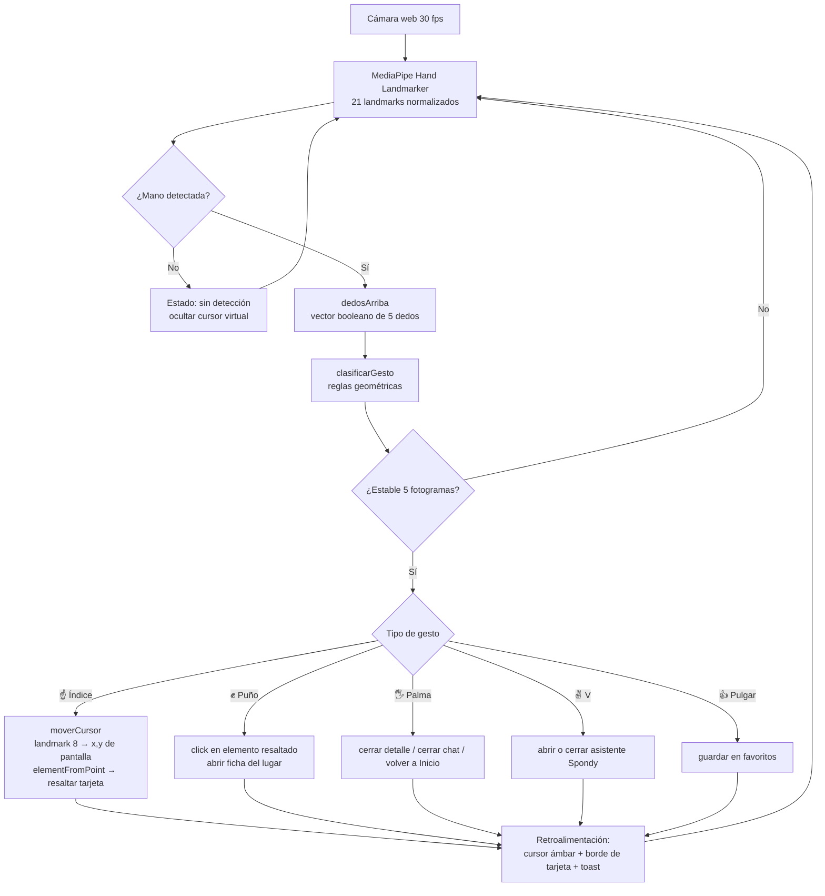
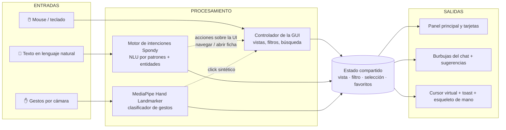
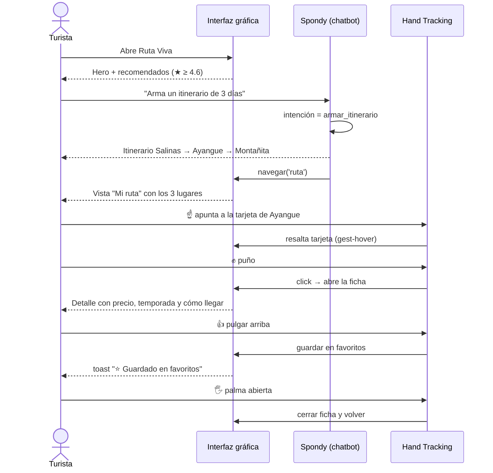

# Diagramas de interacción — Ruta Viva (G2 Turismo Inteligente)

Los diagramas están en formato Mermaid. Para presentarlos:
- pegar el bloque en <https://mermaid.live> y exportar como PNG, o
- reconstruirlos en **Miro / FigJam / Lucidchart** siguiendo la misma estructura.

---

## 1. Flujo de reconocimiento de gestos (Hand Tracking)

---

## 2. Arquitectura multimodal del sistema

---

## 3. Recorrido del usuario (tarea: "planificar fin de semana")

---

## 4. Mapa gesto → acción

| Gesto | Landmarks clave | Regla de detección | Acción |
|---|---|---|---|
| ☝️ Índice | 8 vs 6 | 1 dedo arriba | Mover cursor / navegar |
| ✊ Puño | 8,12,16,20 vs 6,10,14,18 | 0 dedos arriba, pulgar recogido | Seleccionar / confirmar |
| 🖐️ Palma | los 4 dedos | ≥ 4 dedos extendidos | Regresar / cerrar |
| ✌️ V | 8,12 arriba; 16,20 abajo | 2 dedos arriba | Abrir / cerrar asistente |
| 👍 Pulgar | 4 vs 0 y 3 | solo pulgar, punta sobre la muñeca | Guardar en favoritos |

**Controles de estabilidad:** confirmación tras 5 fotogramas consecutivos (~160 ms) y anti-rebote de 900 ms entre acciones discretas.
